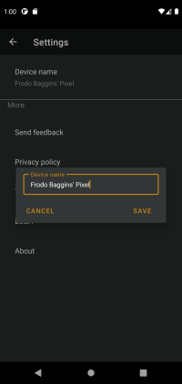

# Loxcall by Smarteon

Loxcall is a free android app that enables you to connect your phone calls to your Loxone smart home. 
In loxone config, you can create any reaction to calls. E.g., turn off the music.  

Available for Android 7.0+ on Google play

-----------------------------

## Prerequisites
* Smartphone with android 7.0+
* [Loxone miniserver](https://shop.loxone.com/enen/miniserver.html) (any model)
* [Loxone config](https://www.loxone.com/enen/support/downloads/)

-----------------------------

## First steps:
1. Download an app from app store
2. [Setup Loxone miniserver](#setup-loxone-miniserver)
3. [Register Loxone miniserver in your Loxcall app](#register-a-miniserver-in-loxcall-app)

-----------------------------

## Setup Loxone miniserver
For proper run, you have to set up your Loxone miniserver.

1. Open Loxone config and connect to your miniserver.
2. Download our [Loxone config template for Loxcall app](../../loxcall/loxcall.Loxone)
3. From our template, copy all blocks from page "Loxcall" to your program.
There are marks prepared witch you can use. The meaning of them is following:
   
* `_CallStateUser` is a miniserver account you use in Loxcall app to register a miniserver.
* `_CallStateDevice` is a device name that has currently active call. You can change the name inside a Loxcall app.
* `_CallStateNumber` is a number calling to you, or a number you are calling to.
* `_CallStateOutput` is an integer value with following meaning:
  * 0 - call ended    
  * 1 - phone is ringing
  * 2 - call started
    
* `_CallActive` is a boolean value with '1' when there is active call detected and '0' otherwise.
* `_CallOnImpulse` gives an impulse in '1' when a call starts.
* `_CallOffImpulse` gives an impulse in '1' when a call ends.
    

-----------------------------

## Register a miniserver in Loxcall app
1. First add a miniserver by clicking a plus button in the bottom right corner.

    

2. Fill the form and click the 'save' button. Note that the app need credentials to a miniserver account with access rights to API and to `_CallState` virtual input. If you don't want to use your private account, create a new one with these rights.

    

3. Your miniserver will appear in the list. Now it is ready.

   

4. You can change your device name by opening a settings from the top right menu.

    

-----------------------------

## Need a help or found an issue? 

Contact us on email [tech@smarteon.cz](mailto:tech@smarteon.cz?subject=[Loxcall]) 

-----------------------------

## Links:

* [Privacy policy](./privacy.md)
* [Terms and Conditions](./terms.md)
* [EULA](./eula.md)
